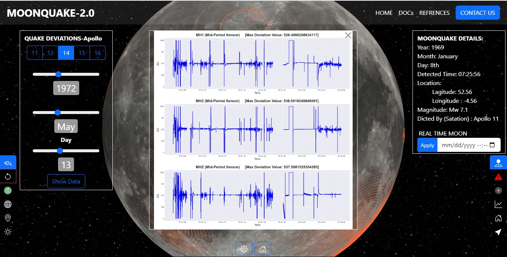

# Moonquake Map 2.0 By Saumya Quake Team 


Visit: https://www.spaceappschallenge.org/2023/find-a-team/saumya-quake/

[](https://ko-fi.com/W7W8QI3N3)

## About

Moonquake Map 2.0, a groundbreaking project developed for the NASA International Space App Challenge 2023. This innovative interactive map brings lunar seismic data and insightful information about moonquakes and the lunar surface right to the fingertips of the public. Explore the mysteries of the Moon like never before with this cutting-edge tool.

 Try out a demo of the map here: [Moonquake Map Demo](https://moonquake.jsdhami.com.np)

## Setup in Local Device
### Clone the Project
```python
git clone https://github.com/jsdhami/SaumyaQuake.git
````
```python
cd SaumyaQuake
```
 and ***run with live Server*** 

## Detailed Project Description

### Moon Map

Moonquake Map 2.0, your gateway to the lunar frontier like never before! This cutting-edge tool unlocks the mysteries of the Moon by generating an immersive and detailed map, unveiling seismic secrets straight from NASA's treasure trove of data.

Prepare to be captivated as Moonquake Map 2.0 showcases shallow moonquakes with mesmerizing ripple effects, vividly illustrating their location and magnitude. But that's not all – this extraordinary map takes you on a journey through the lunar landscape, unraveling its topography with precision. Explore the hallowed grounds of Apollo landing sites and other monumental lunar missions, all seamlessly integrated into this interactive masterpiece.

Behind the scenes, our developers harnessed the power of Bootstrap, weaving a sleek and intuitive frontend. With the magic of Globe.Gl JavaScript, underpinned by the versatility of Three.js, and the data manipulation wizardry of d3, Moonquake Map 2.0 brings the Moon closer than ever before. JSON/CSV data feeds fuel the engine, and React lends its brilliance to craft an interface that's not just informative but also a joy to navigate.

Discover the future of lunar exploration with Moonquake Map 2.0, where user-friendly functions make every interaction a delightful experience. Dive into a world of moonquakes, topography, and historic missions, all at your fingertips. Unlock the lunar wonders, one click at a time.


## How does it work?

Step into the fascinating world of lunar exploration with the Moonquake 2.0 template! As soon as you arrive on our website, you're presented with the enticing option to embark on an extraordinary scientific journey. With a simple click, you'll be transported into our immersive main interface, where the moon's mysteries unfold before your eyes. It's features:

- Topography
- Meridian For Longitude 
- Lunar Landing
- Real Time Moon 
- Explore Nakamura
- Danger Zone
- Deviation Graph
- Interactive 3-D

Within this captivating interface, you wield the power to control the 3D visualization of the moon like never before. Imagine adjusting the moon's topography, navigating along its meridian for longitude, witnessing a lunar landing, or even experiencing real-time lunar activity. The possibilities are as boundless as the cosmos itself.

But that's not all – our Moonquake app takes your lunar adventure to the next level. Toggle between different features effortlessly, from exploring Nakamura's secrets to delving into the 'Danger Zone' for mission preparation. Wondering how to predict the impact and hazards of lunar missions? The 'Danger Zone' feature has your back.

And for the ultimate lunar experience, the 'Nakamura Show' lets you visualize Moonquakes in exquisite detail, offering insights based on various factors such as time, date, magnitude, and location. It's a mesmerizing journey through the moon's seismic history.

Are you ready to unlock the secrets of the moon? Join us on this incredible scientific voyage with the Moonquake app 2.0 – where the moon's wonders await your exploration.


## Benefits

Moonquake Map 2.0 offers several benefits:

- **Seismic Activity Visualization**: Users can explore seismic activity on the moon, visualizing moonquakes in specific locations with detailed information.

- **Lunar Topography**: The map provides insights into the lunar surface's topography, enhancing our understanding of the moon's geography.

- **Reference Data**: Important historical moon mission data, such as Apollo landing sites, is readily available for reference.

- **User-Friendly Interface**: The tool's interface is user-friendly and allows users to adjust various parameters for a customized experience.

- **Real Time Moon**: Experience the Moon's current appearance as seen from our home planet. Watch the lunar landscape evolve in real time.
## What do you hope to achieve?

Our project is a catalyst for innovation, igniting the flames of creativity and critical thinking. Through captivating data visualization, we aim to inspire the next generation of students and researchers to embark on a journey of lunar discovery, unveiling the mysteries of the Moon's surface and the enigmatic Moonquakes. Our app serves as a gateway to the cosmos, cultivating curiosity and nurturing the spirit of exploration. Moreover, it conquers the challenge of rendering lunar seismic activities in breathtaking 3D, making the lunar landscape come alive before your eyes.



## Tools Used To Develop the Project

- Bootstrap
- Globe.Gl JavaScript library (Three.js based)
- d3 open-source library
- React
- JSON/CSV data format
- Plot Library
- Python Pandas Library 
- Obspy


## Space Agency Data
Data used to make this app from different space agency are provided with the links.
https://moon.nasa.gov/resources/13/apollo-11-seismic-experiment/

https://history.nasa.gov/alsj/HamishALSEP.html

https://trek.nasa.gov/moon/

https://pds-geosciences.wustl.edu/missions/apollo/seismic_event_catalog.htm

https://pds-geosciences.wustl.edu/missions/apollo/apollo_pse.htm

https://www.esa.int/

https://www.cnsa.gov.cn/english/n6465652/n6465653/index.html


## Reference

Data used to make this app from different space agency are provided with the links.
https://moon.nasa.gov/resources/13/apollo-11-seismic-experiment/

https://history.nasa.gov/alsj/HamishALSEP.html

https://trek.nasa.gov/moon/

https://pds-geosciences.wustl.edu/missions/apollo/seismic_event_catalog.htm

https://pds-geosciences.wustl.edu/missions/apollo/apollo_pse.htm

https://www.esa.int/

https://www.cnsa.gov.cn/english/n6465652/n6465653/index.html


https://github.com/jsdhami/SaumyaQuake

https://moonquake.jsdhami.com.np


### Repo Activity


